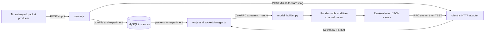

# NeuroDevHackathon

A hackathon prototype for storing timestamped multichannel sensor packets and selecting candidate events through Python processing and a Node.js network bridge.

## Goal

Explore a sensor-data pipeline from HTTP packet ingestion and MySQL storage through
Socket.IO events and ZeroRPC to tabular Python processing. The repository includes
an EEG-oriented exploratory notebook; it does not contain a model-training pipeline.
The event selector is a rank-based statistical heuristic.

## Requirements

### Software

- Python 3.12; install the constrained dependencies in `requirements.txt`.
- Node.js, npm, and a C/C++ build toolchain for the native ZeroMQ dependency.
- MySQL for the historical network pipeline. Version and original schema are
  **Not documented in the original repository**.
- Optional notebook tools: Jupyter and Matplotlib (not needed by the processor).

### Build

```sh
python3 -m venv .venv
. .venv/bin/activate
python -m pip install -r requirements.txt
npm ci
cp .env.example .env
# Edit .env with your own local database settings, then export it in each shell:
set -a; . ./.env; set +a
```

`.env` is loaded by the shell; there is no automatic dotenv loader. `DB_USER`,
`DB_PASSWORD`, and `DB_NAME` are required by the database services and placeholder
values are rejected. `DB_HOST` defaults to loopback. `RPC_ENDPOINT`, `WS_URL`,
`CLIENT_URL`, `PORT`, `CLIENT_PORT`, and `WS_PORT` control local service routing.
The reserved `NEURO_API_TOKEN` is unused by the active pipeline.

### Running

The reproducible offline path uses only generated values:

```sh
python examples/generate_packets.py > sample-packets.json
python -c 'import json; from model_builder import build_plot; print(build_plot(json.load(open("sample-packets.json"))))'
```

For the historical integration, provision a local MySQL database and an `instances`
table with `jsonFile` (packet JSON text) and `experiment` (experiment tag) columns.
These are the columns read/written by source; an original migration and validated
schema are not present. Start these in four terminals with the environment loaded:

```sh
python model_builder.py   # ZeroRPC, default loopback port 4242
node ws.js                # Socket.IO, port 25565
node client.js            # HTTP-to-Socket.IO adapter, port 3035
node server.js            # HTTP ingestion, port 3030
```

This documents the existing component wiring; the full database/network workflow
has not been validated. See the known failures below. Keep services on an isolated
local machine; the HTTP servers listen on all interfaces.

### Testing

```sh
python -m unittest discover -s tests -v
python tests/rpc_smoke.py  # requires local IPC socket permissions
npm test
node --check server.js
node --check client.js
node --check socketManager.js
node --check ws.js
```

`tests/` contains automated tests. The older `test/` directory is a separate manual
Socket.IO demo, with its own historical package lock and placeholder `npm test`;
it is not an automated test suite. See [validation notes](docs/VALIDATION.md) for
actual commands, runtime versions, outcomes, and dependency compatibility work.

## Implementation

### Architecture and Data Flow



This is the intended source-level route; the HTTP response bridge remains
incomplete. There is no direct sensor acquisition client in the active code.

### Packets and Event Selection

A synthetic input packet:

```json
{"Timestamp": 0, "DataPacketValue": [0.0, 0.1, 0.2, 0.3, 0.4, 0.5]}
```

`packets_to_table` takes a list of packets. Each packet must contain a nonempty
string or finite numeric timestamp and exactly six finite numeric channels.
Timestamp units and physical channel meanings are **Not documented in the original
repository**. Extra metadata is ignored by processing. The timestamp becomes the
index; duplicate timestamps keep the last packet, matching the original mapping.
Channel columns are `Value_0` through `Value_5`.

`detect_events` averages channels 0, 1, 2, 3, and 5, omitting channel 4 as in the
original formula. It selects the values at descending ranks 6–15 and returns every
matching row in arrival order; ties can produce more than ten events. It does not
select the ten largest observations. Fewer than six observations yield no events.
There is no learned model, calibration, clinical interpretation, or validated
anomaly threshold.

`build_plot` returns a JSON string mapping sequence numbers to records such as
`{"0":{"index":5,"Value":5.22}}`. The RPC method `streaming_range(stage, packets,
arg)` streams this string followed by the supplied `arg`; `stage` is unused.
Despite its name, `build_plot` does not draw a plot.

The original script could not parse because of mixed indentation. Its variance
filter could delete channels still referenced by the mean. The extracted function
keeps all six validated channels, removes that contradictory filter, and uses a
bounded slice for short inputs. The rank window, omitted channel, duplicate and
tie behavior are preserved. This is an explicit prototype correctness change;
there was no executable baseline output to compare.

### Main Components

- `server.js`: `POST /input` stores `data` (a JSON-encoded packet string) and `tag`;
  `/finish` forwards `title`; `/get` is unfinished.
- `client.js`, `ws.js`, `socketManager.js`: HTTP, Socket.IO, MySQL lookup, and RPC
  adapters. `FINISH` selects records by experiment and emits `TEST` responses.
- `model_builder.py`: importable conversion/selection functions and optional RPC
  server entry point.
- `PythonStash/Model_Muse.ipynb`: historical CSV exploration and plotting, separate
  from the six-channel processor; it averages four notebook channels.
- `4`: preserved historical server variant; not a documented entry point.

### Security

Credentials and external service addresses were removed from current code.
[SECURITY_REMEDIATION.md](SECURITY_REMEDIATION.md) lists required JWT/password
rotation and separate history cleanup. Existing CSV provenance and publication
consent are unknown; examples and tests exclusively use generated numbers.

### Attribution and Contributions

Presented conservatively as a hackathon team prototype. Git history contains one
commit credited to **Андрей Шибаев**. Team membership, division of work, and individual
contribution are **Not documented in the original repository**. Repository ownership
does not establish authorship of every component. Existing package metadata declares
ISC; no standalone license file was present.

## Conclusions

The source demonstrates packet reshaping, a simple rank heuristic, and integration
boundaries between HTTP, Socket.IO, relational storage, and Python RPC. The
synthetic tests make data-shape and event-selection behavior inspectable.

Known limitations:

- `/input` never completes its HTTP response after insertion.
- `/finish` discards the Axios result inside a `.then` callback and then accesses
  the missing result; `/get` uses unfinished event handling.
- Initial and `GETTOP` RPC calls send a number instead of a packet list.
- `client.js` uses `client.emit` instead of the connected `socket` in `/get/:id`;
  its `TEST` listener can outlive requests and the two-item RPC stream.
- No schema migration, database integration test, hardware run, authentication,
  backpressure, delivery guarantee, latency measurement, or detector evaluation.
- Sensor units, rationale for omitted channel/rank window, and data consent remain
  open questions. Do not treat these events as a validated sensor interpretation.

These incomplete adapters were documented without redesigning the historical
network architecture. Full integration and dependency-security work remain TODOs.

## Topics Studied

- Multichannel timestamped sensor packets
- Pandas/NumPy tabular transformation
- Rank-based statistical event selection and boundary testing
- HTTP, Socket.IO, and ZeroRPC service integration
- MySQL-backed packet storage
- Configuration separation and credential-remediation practices
